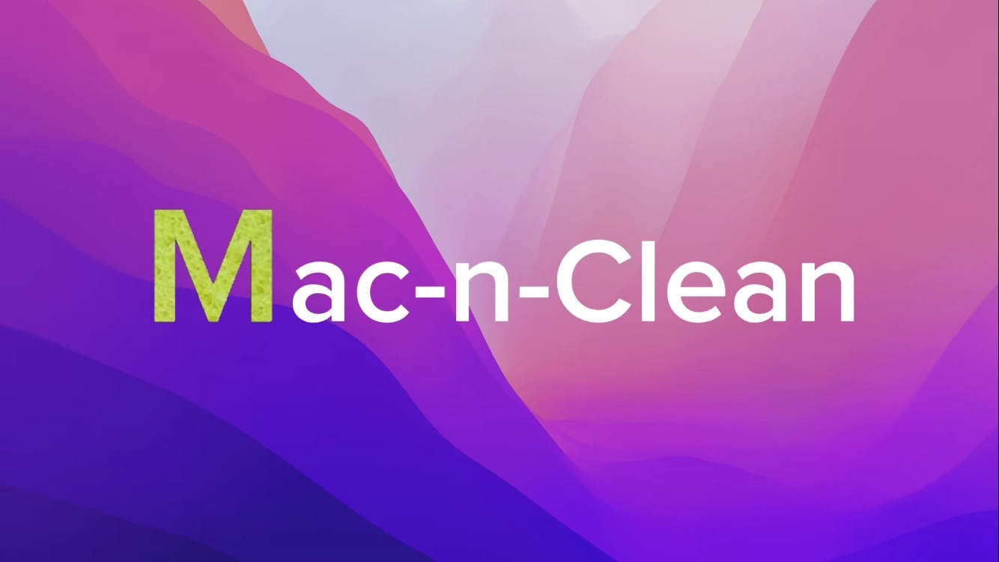

# Mac-n-Clean
<p align="center">
  
</p>

<h1 align="center">🧹 Mac-n-Clean</h1>

<p align="center">
  <strong>A safe Python script to tidy your Mac</strong>
</p>

> **Mac-n-Clean**: A simple Python script to clean macOS Cache & Logs. Removes files older than 30 days. Safe dry-run mode included. **Downloads are NOT touched.**

This tool helps you free up disk space on macOS by removing old temporary files from `~/Library/Caches` and `~/Library/Logs`. It prioritizes safety with a default dry-run mode and explicitly excludes your Downloads folder.

**✨ Features**
- 🛡️ **Safe Dry-Run Mode**: See exactly what will be deleted before acting.
- 📂 **Smart Targets**: Cleans `~/Library/Caches` and `~/Library/Logs` only.
- ⏱️ **Age-Based Cleanup**: Only removes files older than 30 days (configurable).
- 🔒 **No Downloads**: Your `~/Downloads` folder is completely safe and untouched.
- 🚀 **Easy to Use**: Just run `python3 cleaner.py`.

**🚀 Usage**
1. **Clone the repository**:
   ```bash
   git clone https://github.com/NOKTAGIO/Mac-n-Clean.git
   cd Mac-n-Clean
2. **Run the script**:
    ```bash
    python3 cleaner.py

The script runs in simulation mode by default. Type oui to confirm real deletion, or non to cancel.

⚠️ Warning Always review the simulation report before confirming deletion. Backup important data first!

📝 License MIT License - Use at your own risk!
